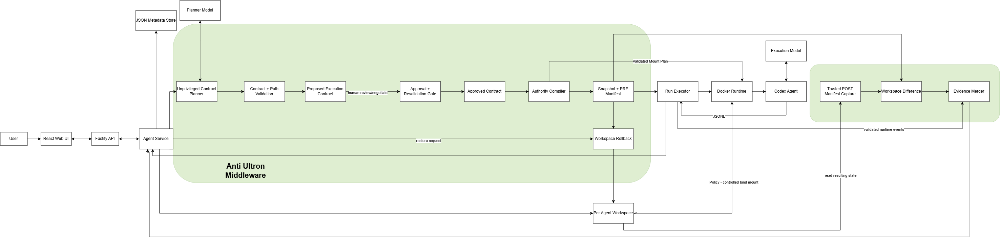

# Anti-Ultron

> **Zero-trust execution middleware for Agent Launchpad.**

### The AI can request authority. It cannot grant itself authority.

Anti-Ultron extends the provided **Agent Launchpad** platform with human-negotiated Execution Contracts, OS/container-enforced workspace write authority, deterministic execution evidence, and trusted Workspace Rollback.

Before Codex can execute a task, Anti-Ultron separates five concerns:

> **Plan → Permit → Enforce → Observe → Recover**

The Agent proposes what it wants to do.  
The human decides what authority it receives.  
Anti-Ultron compiles that authority into runtime capabilities.  
The system independently observes what actually happened.  
The workspace can be restored without asking the same Agent to undo itself.

---

## The problem

A developer might ask an autonomous coding agent:

> “Fix authentication, add tests, and update the documentation.”

That one sentence can turn into:

- file inspection;
- shell commands;
- source-code changes;
- configuration edits;
- new files;
- dependency operations;
- test execution.

The problem is not necessarily malicious intent.

The problem is that a high-level task can result in the Agent receiving much broader persistent write authority than the task actually needs.

Anti-Ultron treats **intent** and **authority** as separate things.

The Agent may request authority.

The human grants it.

---

# How Anti-Ultron works

```text
User task
   ↓
Unprivileged AI preflight
   ↓
Execution Contract
   ↓
Human review / negotiation
   ↓
Explicit approval
   ↓
Authority compiler
   ↓
OS-enforced workspace write policy
   ↓
Codex execution
   ↓
Runtime + workspace evidence
   ↓
Optional Workspace Rollback
```

---

## 1. Unprivileged AI preflight

Before Codex executes the task, Anti-Ultron uses a separate AI planning stage.

The planner receives:

- the user task;
- Agent instructions;
- a bounded workspace inventory.

It does **not** receive:

- shell access;
- Codex execution;
- Docker execution;
- workspace-write capability;
- arbitrary tools.

Its only job is to propose an **Execution Contract**.

Example:

```text
Goal
Improve email validation and test coverage.

Plan
1. Inspect the current authentication implementation.
2. Improve validation logic.
3. Add edge-case tests.
4. Run the authentication test suite.
5. Update README.md.

Requested write authority
src/**
tests/**
README.md

Protected
.env
deployment/**

Risk
Low
```

The planner can request authority.

It cannot use that authority.

---

## 2. Human-negotiated Execution Contracts

An AI proposal is only a proposal.

The planner may request:

```text
Writable
src/**
tests/**
README.md
```

The human may instead approve:

```text
Writable
src/**
tests/**

Protected
README.md
.env
deployment/**
```

Before approval, the user can:

- add or remove writable scopes;
- add protected paths;
- negotiate changes using natural language;
- configure authority manually;
- retry a failed AI proposal;
- cancel the Run.

Codex remains inactive during this process.

---

## 3. Fail-closed planning

The planner is not trusted to grant permissions.

If it:

- times out;
- is rate-limited;
- returns malformed JSON;
- returns a schema-invalid proposal;
- proposes invalid workspace paths;
- becomes unavailable;

Anti-Ultron does not grant broader access.

It falls back to:

```text
Writable authority = none
```

The workspace therefore remains read-only until the human explicitly defines and approves authority.

> **AI failure never increases AI privilege.**

---

## 4. Backend-controlled approval

The React frontend is not the security boundary.

Submitting a task creates an `awaiting_approval` Run. Codex is not scheduled at that point.

Only the backend approval transition:

1. validates the contract;
2. prepares the approved authority;
3. freezes the approved contract;
4. records approval;
5. queues execution.

The execution path rechecks that the Run is approved before Codex can start.

---

## 5. Runtime-enforced workspace authority

After approval, trusted backend code validates and compiles the contract.

The write-authority precedence rule is:

```text
Protected paths
      >
Approved writable paths
      >
Default read-only workspace
```

For example:

```text
Writable
src/**

Protected
src/secrets.ts
```

means:

```text
src/auth.ts       read/write
src/api.ts        read/write
src/new.ts        read/write

src/secrets.ts    read-only

README.md         read-only
package.json      read-only
.env.production   read-only
```

Anything outside an approved writable scope remains read-only.

---

## 6. OS/container enforcement

The Execution Contract is not merely a prompt telling Codex to behave.

Anti-Ultron converts the approved policy into Docker/Linux filesystem capabilities.

Conceptually:

```text
/workspace                  READ ONLY
approved writable scopes    READ + WRITE
protected scopes            READ ONLY
```

The autonomous Agent runs inside a disposable container.

Whether Codex attempts a write using:

- shell commands;
- Node.js filesystem APIs;
- Python;
- another tool;

the same underlying OS-level workspace write policy applies.

The enforcement therefore sits below the model layer.

---

## Approved Contract history

Approval does not make the contract disappear.

Each approved Run keeps an immutable record containing:

- goal;
- planned actions;
- approved writable scopes;
- protected paths;
- risk level;
- approval time.

This allows the user to answer:

> **What exactly did I authorize for this Run?**

The Approved Contract remains separate from execution evidence.

---

## Plan ≠ evidence

Anti-Ultron deliberately distinguishes:

### Planned intent

What the AI proposed or intended to do.

from:

### Executed evidence

What runtime and workspace evidence show actually happened.

An approved plan is never treated as proof that an action occurred.

---

# Execution evidence

Anti-Ultron combines two complementary evidence sources.

## Codex Runtime JSONL

Used conservatively for supported observations such as:

- commands;
- file inspections;
- recognised test commands;
- command outcomes;
- supported attributable authority-block events.

## PRE / POST workspace comparison

Trusted backend code captures bounded workspace manifests before and after Agent execution.

Regular-file contents are fingerprinted using SHA-256.

Example:

```text
PRE
src/auth.ts → ABC

POST
src/auth.ts → XYZ

ABC != XYZ
→ Modified src/auth.ts
```

Likewise:

```text
Absent before + present after
→ Created

Present before + absent after
→ Deleted
```

This lets Anti-Ultron report **net resulting regular-file content changes** without trusting the Agent's final response.

The UI can show:

```text
Modified src/auth.ts
Modified tests/auth.test.ts

Blocked README.md
Reason: Explicitly protected

Test command passed
```

Sanitised technical details remain expandable.

---

## Honest test-command results

Anti-Ultron does not claim that a passing test proves the generated code is correct.

It reports only what runtime evidence supports:

```text
Test command passed
Test command failed
Test command not observed
```

Shell constructions that may mask the real test result are treated conservatively.

Examples:

```bash
npm test || true
npm test; true
npm test | tee output.txt
npm test && another-command
```

are not used to infer an unambiguous successful test outcome.

If likely test files were changed during the same Run, Anti-Ultron also warns:

```text
Test command passed

Test files were modified during this Run
```

The Agent's final narrative cannot establish test status.

---

## Supported authority-block evidence

When runtime evidence can deterministically attribute a failed write to a non-writable workspace path, Anti-Ultron explains the denial.

For example:

```text
Blocked README.md
Reason: Explicitly protected
```

or:

```text
Blocked random-root-file.txt
Reason: Outside approved write authority
```

Anti-Ultron only labels a policy block when runtime evidence and the compiled authority are sufficient to support that attribution.

Ambiguous permission failures are not presented as proven Anti-Ultron blocks.

---

# Trusted Workspace Rollback

Before an approved Run begins execution, Anti-Ultron creates a trusted bounded snapshot of the Agent workspace.

```text
Authority prepared
   ↓
Pre-run Workspace Snapshot
   ↓
PRE evidence capture
   ↓
Codex execution
```

For an eligible Run, the user can select:

```text
Restore pre-run state
```

Trusted backend code then restores the persistent workspace:

```text
Modified file → previous contents restored
Created file  → removed
Deleted file  → restored
```

Codex does not perform the rollback.

Historical execution evidence remains visible because the original actions still occurred.

An older Run cannot be rolled back after a newer Run executes against the same workspace, preventing recovery from silently deleting newer work.

---

# Anti-Ultron V1 capabilities

Anti-Ultron V1 intentionally focuses on one security boundary:

> **persistent workspace mutation authority**

| Capability | V1 |
| --- | --- |
| Human approval before Codex execution | ✅ Backend enforced |
| Workspace read-only by default | ✅ Container enforced |
| Approved writable scopes | ✅ Container enforced |
| Protected paths override writable scopes | ✅ Container enforced |
| Planner failure | ✅ Fails closed to zero write authority |
| Approved Contract history | ✅ Persisted per Run |
| Resulting regular-file content changes | ✅ Independently observed |
| Supported attributable authority blocks | ✅ Observed and explained |
| Test-command result | ✅ Runtime-derived |
| Workspace Rollback | ✅ Supported for eligible Runs |

---

# Architecture



The diagram shows the separation between:

- Agent Launchpad's application layer;
- Anti-Ultron's control plane;
- untrusted Agent execution;
- trusted evidence collection;
- trusted recovery.

The key authority rule is:

```text
Protected paths
      >
Approved writable paths
      >
Default read-only workspace
```

The planner and Codex are not trusted to enforce policy themselves.

Trusted backend validation and the container Runtime enforce the human-approved workspace write boundary.

Both PRE and POST workspace evidence are captured by trusted backend code rather than by Codex.

For a deeper component-level description, see:

[`docs/ARCHITECTURE.md`](docs/ARCHITECTURE.md)

---

# Adversarial validation

Anti-Ultron is tested against real filesystem-boundary attacks rather than only happy-path UI behaviour.

| Scenario | Result |
| --- | --- |
| Write inside approved scope | ✅ Allowed |
| Create file inside approved directory | ✅ Allowed |
| Write outside approved authority | 🚫 Blocked |
| Create root file outside authority | 🚫 Blocked |
| Protected child inside writable parent | 🚫 Blocked |
| Shell write against protected boundary | 🚫 Blocked |
| Node filesystem write against protected boundary | 🚫 Blocked |
| Python write against protected boundary | 🚫 Blocked |
| Unsafe / traversal authority path | 🚫 Rejected |
| Unsafe symlink / hard-link authority target | 🚫 Rejected |
| Planner unavailable | 🔒 Zero write authority |
| Resulting regular-file content change | 🔎 Independently observed |
| Masked/chained test command | 🔎 Not falsely reported as passed |
| Unwanted workspace changes | ↩ Workspace Rollback |

Current repository validation:

```text
134 deterministic tests passed
Mandatory Docker integration: 1 passed, 0 skipped
Production dependency audit: 0 known vulnerabilities
```

---

# Round 1 demo scenario

The recorded demo uses one end-to-end scenario.

## User task

```text
Improve the email validation so addresses containing consecutive dots
are rejected.

Add corresponding edge-case tests, run the authentication test suite,
and update README.md to document the new validation behaviour.
```

The planner requests the authority it expects to need.

The human then approves:

```text
Writable
src/**
tests/**

Protected
README.md
.env
deployment/**
```

During execution:

```text
src/auth.ts             modified
tests/auth.test.ts      modified
README.md               blocked
test command            executed
```

Anti-Ultron then shows:

- the immutable Approved Contract;
- resulting regular-file changes;
- supported policy-denial evidence;
- the observed test-command result;
- the recovery option.

The user can finally select:

```text
Restore pre-run state
```

to restore the workspace without asking Codex to undo itself.

---

# Running Anti-Ultron locally

The complete Anti-Ultron V1 write-authority flow is demonstrated through the local disposable-container POC.

## Requirements

- Node.js 22+
- npm
- Docker
- BytePlus ModelArk credentials

## Install

```bash
npm install
```

## Start

Anti-Ultron supports separate planner and execution models.

```bash
ARK_API_KEY="YOUR_KEY" \
ARK_MODEL="YOUR_EXECUTION_MODEL" \
ARK_PLANNER_MODEL="YOUR_PLANNER_MODEL" \
ARK_PLANNER_TIMEOUT_MS="30000" \
ARK_BASE_URL="https://ark.ap-southeast.bytepluses.com/api/v3" \
npm run poc
```

Then open:

```text
http://localhost:3000
```

### Model roles

```text
ARK_MODEL
→ Codex execution model

ARK_PLANNER_MODEL
→ unprivileged preflight model
```

If `ARK_PLANNER_MODEL` is omitted, it falls back to `ARK_MODEL`.

`ARK_BASE_URL` is configurable. The command above uses the BytePlus ModelArk Singapore OpenAI-compatible endpoint used for this submission.

Never commit a real `ARK_API_KEY`.

## Deployment note

The full V1 Execution Contract flow requires the **container Runtime** used by `npm run poc`.

The inherited Docker Compose and ECS profiles use the `local-process` runner.

That runner cannot approve or execute V1 authority contracts, so those profiles do **not** provide the demonstrated V1 container-enforced Execution Contract flow.

They remain starter/deployment scaffolding rather than V1 execution-parity environments.

---

# Validation

Build the default Runtime image:

```bash
docker build \
  -f Dockerfile.runtime \
  -t volc-agent-runtime:local \
  .
```

Verify the Runtime contains the required tools:

```bash
docker run --rm volc-agent-runtime:local \
  sh -lc 'command -v node && command -v python3'
```

Run the normal checks:

```bash
npm run check
```

The normal suite intentionally skips the real Docker integration test.

Run that explicitly:

```bash
AGENTGUARD_CONTAINER_INTEGRATION=1 \
AGENTGUARD_RUNTIME_IMAGE=volc-agent-runtime:local \
npm run test -w @launchpad/server -- \
src/container-codex-runner.integration.test.ts
```

Expected:

```text
1 passed
0 skipped
```

Production dependency audit:

```bash
npm audit --omit=dev
```

Current result:

```text
Critical: 0
High: 0
Moderate: 0
Low: 0
```

---

# Security boundary

Anti-Ultron V1 protects the integrity of the persistent Agent workspace by controlling where an approved Run may write.

It is not a complete Agent sandbox or confidentiality boundary.

V1 does not claim to provide:

- workspace read confidentiality;
- secret-exfiltration prevention;
- network-egress policy;
- external API, database or cloud permission control;
- contract-level compute authority;
- protection from a compromised host, container daemon or kernel;
- semantic correctness guarantees for generated code;
- complete rollback of side effects outside the persistent workspace.

For example, marking `.env` read-only prevents the Agent from modifying `.env`.

It does not prevent the Agent from reading that file or transmitting its contents if network access exists.

See [`SECURITY.md`](SECURITY.md) for the detailed threat model.

---

# Known limitations

## Exact-file writable mounts

Exact-file bind mounts can conflict with programs that save by creating a temporary file and atomically renaming it over the mounted target.

Linux/Docker may reject this with `EBUSY`.

Directory scopes such as:

```text
src/**
tests/**
```

are therefore the preferred V1 authority primitive.

A staging or OverlayFS-based workspace is a possible future direction.

---

## Workspace evidence

PRE/POST comparison covers **net resulting regular-file content changes**.

It does not provide a complete filesystem syscall audit.

It does not fully represent:

- symlink-only changes;
- empty-directory changes;
- metadata-only changes;
- transient writes restored before the Run completes.

---

## Workspace Rollback

A complete trusted snapshot is required before Codex starts.

Current V1 limits are:

```text
20,000 filesystem entries
10,000 regular files
64 path components
10 MiB per regular file
100 MiB total regular-file content
4 KiB maximum symlink target length
8 MiB maximum snapshot manifest size
```

If a complete snapshot cannot be created and validated within those bounds, the Run does not start.

Workspace Rollback restores the persistent Agent workspace only.

It does not reverse:

- network actions;
- external-service calls;
- package-manager or global caches outside the workspace;
- arbitrary system/environment state outside the workspace.

---

## Codex session state

The current POC is single-user.

Persistent Codex home/session state is not a per-Agent multi-tenant confidentiality or integrity boundary.

---

# Provider configuration

The Anti-Ultron submission is demonstrated using **BytePlus ModelArk** through its configurable OpenAI-compatible Responses endpoint.

Runtime configuration is controlled through:

```text
ARK_API_KEY
ARK_MODEL
ARK_PLANNER_MODEL
ARK_PLANNER_TIMEOUT_MS
ARK_BASE_URL
```

The repository retains some inherited Ark/Volcengine naming internally because Agent Launchpad was originally built around that provider family.

`ARK_BASE_URL` is authoritative at runtime.

For the Anti-Ultron submission, the demonstrated endpoint is:

```text
https://ark.ap-southeast.bytepluses.com/api/v3
```

---

# What Anti-Ultron adds

Anti-Ultron was built on the **Agent Launchpad** starter repository provided for the hackathon.

The submission-specific middleware added on top of that foundation includes:

- unprivileged AI preflight planning;
- Execution Contracts;
- natural-language contract negotiation;
- human-editable writable and protected authority;
- fail-closed fallback and planner retry;
- deterministic contract and path validation;
- default-deny workspace write authority;
- protected-path overrides;
- Docker/OS-enforced writable scopes;
- immutable Approved Contract history;
- deterministic execution evidence;
- PRE/POST workspace mutation observation;
- supported authority-block explanations;
- conservative test-command evidence;
- test-file mutation warnings;
- trusted pre-run Workspace Rollback;
- rollback ordering protections;
- adversarial and integration testing;
- the Anti-Ultron middleware UX.

The underlying:

- Agent CRUD;
- Playground;
- persistent Agent workspaces;
- resumable Codex session foundation;
- starter application/runtime infrastructure;

came from Agent Launchpad.

---

# Starter-kit attribution

The untouched original Agent Launchpad README is preserved separately at:

[`STARTER_README.md`](STARTER_README.md)

That file is retained for attribution and reference and should not be interpreted as Anti-Ultron submission functionality.

---

# Anti-Ultron

### Plan → Permit → Enforce → Observe → Recover

> **The AI can request authority. It cannot grant itself authority.**