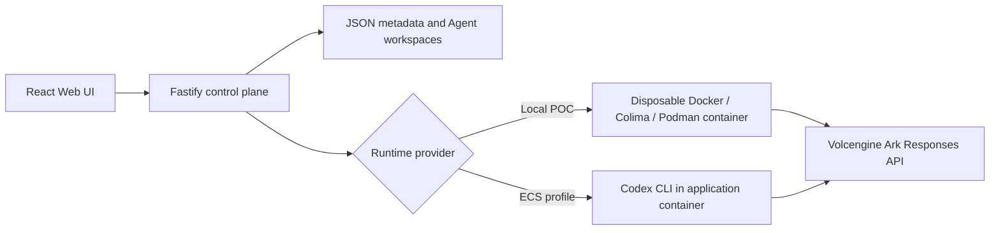

# Volc Agent Launchpad

A minimal Agent platform for three-day middleware hackathons. It provides Agent
CRUD, a browser Playground, persistent workspaces, and Codex CLI backed by the
Volcengine Ark Responses API.

Run it locally with Docker, Colima, or rootless Podman, or deploy it to
Volcengine ECS.

> [!WARNING]
> This is a single-user proof of concept. Ultr0n enforces approved persistent
> workspace mutation in the container Runtime, but it is not a general-purpose
> hardened sandbox or a confidentiality boundary. It intentionally has no user
> identity, comprehensive tracing, or complete audit system. Do not use
> production data or credentials. See [SECURITY.md](SECURITY.md).

## Screenshots

### Agent Playground


### Create an Agent


## Features

- React and TypeScript Web UI
- Agent create, edit, start, stop, delete, and multi-turn chat
- Fastify control plane with asynchronous Run state
- Persistent Agent workspaces and Codex sessions
- Disposable Docker, Colima, or Podman container for each local turn
- Docker and Terraform deployment paths for Volcengine ECS

## Requirements

- Node.js 22+
- npm 10+
- Docker, Colima, or Podman
- A Volcengine Ark API key and endpoint that supports the Responses API

Codex CLI is included in the Runtime image and is not required on the host.

## Local browser SOP

### 1. Check the local tools

Install Node.js 22+ and one supported container engine, then verify them:

```bash
node --version
npm --version
docker --version        # Docker Desktop, Docker Engine, or Colima
podman --version        # Use this instead when running Podman
```

Only one container engine is required. Codex CLI is already included in the
Runtime image.

### 2. Clone the repository

```bash
git clone <repository-url> volc-agent-launchpad
cd volc-agent-launchpad
```

Skip this step when already working from the repository root.

### 3. Start the POC

```bash
ARK_API_KEY=your-ark-api-key \
ARK_MODEL=ep-your-endpoint-id \
npm run poc
```

The first run installs Node.js dependencies and builds the Runtime image. The
script automatically selects Docker, Colima, or Podman.

### 4. Open the browser

Visit <http://localhost:3000>, or open it from the terminal:

```bash
open http://localhost:3000       # macOS
xdg-open http://localhost:3000   # Linux desktop
```

In the Web UI:

1. Select **Create Agent**.
2. Enter a name, description, and workspace instructions.
3. Select **Create Agent** again.
4. Enter a task in the Playground, for example:

   ```text
   Create a TypeScript hello-world CLI, add a test, and run it.
   ```
5. Review the proposed Execution Contract, adjust its workspace scopes if
   needed, then select **Approve & Run**.

Only after approval can Codex run commands and write within the approved
workspace scopes. Later messages can continue the same Codex session.

### 5. Stop and resume

Press `Ctrl+C` in the startup terminal. The script removes temporary Runtime
containers but keeps Agent workspaces and conversations.

- macOS state: `~/.volc-agent-launchpad/`
- Linux state: `.local/`
- Custom location: set `LOCAL_POC_DATA_ROOT`

Run the same `npm run poc` command to continue later.

### Select a specific container engine

Force Podman when multiple engines are installed:

```bash
CONTAINER_ENGINE=podman \
ARK_API_KEY=your-ark-api-key \
ARK_MODEL=ep-your-endpoint-id \
npm run poc
```

Colima uses `CONTAINER_ENGINE=docker` because it exposes the Docker CLI.

For a clean Linux host, follow the
[rootless Podman setup](docs/LOCAL_POC.md#rootless-podman-on-linux).

## Docker Compose

Create and edit the configuration:

```bash
./scripts/bootstrap-local.sh
```

Required values in `.env`:

```dotenv
ARK_API_KEY=your-ark-api-key
ARK_MODEL=ep-your-endpoint-id
APP_AUTH_TOKEN=replace-with-at-least-24-random-characters
```

Start the application:

```bash
docker compose up --build
```

Open <http://localhost:3000>. Stop it without deleting Agent data:

```bash
docker compose down
```

## Development

```bash
npm install
cp .env.example .env
npm install --global @openai/codex@0.111.0
npm run dev
```

- Web UI: <http://localhost:5173>
- API: <http://localhost:3000>

Use local paths in `.env` when running outside Docker:

```dotenv
APP_DATA_DIR=.data
AGENT_WORKSPACE_ROOT=workspaces
CODEX_HOME=codex-home
```

## Deployment

- [Existing Linux ECS with Docker](docs/DEPLOYMENT.md#existing-linux-ecs)
- [Complete Volcengine environment with Terraform](docs/DEPLOYMENT.md#terraform-deployment)
- [Local Docker, Colima, and Podman details](docs/LOCAL_POC.md)

The existing-ECS script deploys from the current source tree:

```bash
cp .env.example .env.production
./scripts/deploy-existing-ecs.sh .env.production
```

The Terraform path provisions VPC, subnet, security group, ECS, and EIP:

```bash
cp deploy/volcengine/terraform.tfvars.example \
  deploy/volcengine/terraform.tfvars
./scripts/deploy-volcengine.sh
```

## Configuration

| Variable | Default | Purpose |
| --- | --- | --- |
| `ARK_API_KEY` | Required | Ark model API key. |
| `ARK_MODEL` | Required | Responses-capable endpoint or model ID. |
| `ARK_PLANNER_MODEL` | `ARK_MODEL` | Optional model used only for Execution Contract planning. |
| `ARK_PLANNER_TIMEOUT_MS` | `30000` | Planner request timeout in milliseconds. |
| `ARK_BASE_URL` | Beijing v3 endpoint | Ark OpenAI-compatible API URL. |
| `APP_AUTH_TOKEN` | Empty on loopback | Shared demo token; use 24+ random characters remotely. |
| `RUNTIME_PROVIDER` | `local-process` | `container` for disposable local Runtime containers. |
| `CODEX_SANDBOX_MODE` | `workspace-write` | Codex inner sandbox mode. |
| `CODEX_TIMEOUT_MS` | `600000` | Maximum duration of one turn. |
| `LOCAL_POC_DATA_ROOT` | Platform-specific | Local metadata, workspace, and session directory. |

See [.env.example](.env.example) for all Runtime and resource-limit options.

## How it works



The first turn uses `codex exec`; later turns resume the stored Codex thread.
Deleting an Agent archives its workspace under `workspaces/.deleted/`.
Approved V1 Execution Contracts are enforced in the local container as a
read-only workspace with explicit read-write exceptions; protected paths always
override writable scopes. See [the Local POC runtime-authority notes](docs/LOCAL_POC.md#runtime-write-authority)
for exact directory/file semantics and limitations.

See [docs/ARCHITECTURE.md](docs/ARCHITECTURE.md) for component and extension
boundaries.

## Threat model and known limitations

**Ultr0n is a zero-trust execution control plane for autonomous coding
agents. The AI can request authority. It cannot grant itself authority.**

V1 primarily governs the integrity of the persistent Agent workspace: which
workspace paths an approved Run may mutate. Its control path is:

```text
untrusted AI proposal
→ deterministic validation
→ human approval
→ trusted authority compiler
→ OS/container-enforced workspace capabilities
```

The effective authority order is:

```text
protected paths
> approved writable paths
> default read-only workspace
```

This is a write-integrity boundary, not a confidentiality boundary.

### Capability boundary at a glance

| Capability | V1 status |
| --- | --- |
| Persistent workspace write authority | Enforced by the container Runtime |
| Protected workspace paths | Enforced; protection overrides writable scope |
| Explicit human approval before Codex | Enforced by the backend lifecycle |
| Resulting workspace mutation evidence | Derived from bounded PRE/POST manifests |
| Workspace Rollback | Supported where an eligible snapshot is available |
| Network egress policy | Out of scope |
| Secret read isolation | Out of scope |
| Compute quotas in the Execution Contract | Out of scope |
| External service or API authority | Out of scope |

### Trust and authority

The human approver is the source of Run authority. The backend—not the React
frontend—stores the contract, validates it, freezes it on approval, and decides
whether execution may start.

| Input or component | Classification | Treatment in V1 |
| --- | --- | --- |
| User task text | Untrusted task content | Planning and execution input; never an authority grant by itself |
| AI planner output | Untrusted proposal | Strictly parsed, schema-validated, path-validated, persisted, and presented for human review |
| Model-generated paths | Untrusted data | Canonicalized and checked before they can contribute to a compiled authority plan |
| Autonomous coding Agent / Codex | Untrusted actor | Starts only after approval and receives the compiled container capabilities |
| Agent final claims | Untrusted narrative | Cannot establish file mutations, authority blocks, or test-command results |
| React frontend | Non-authoritative client | Displays and edits a draft; backend state remains authoritative |
| Backend approval lifecycle | Trusted control plane | Prevents execution before approval and freezes the approved contract |
| Contract validation and `WorkspaceAuthority` compiler | Trusted policy code | Converts approved paths into the effective mount plan |
| Workspace manifest, snapshot, and rollback code | Trusted integrity/recovery code | Derives resulting state and restores eligible pre-Run workspace snapshots |
| Host OS, container engine/daemon, and container runtime | Trusted computing base | Assumed uncompromised for the stated enforcement guarantees |

The planner makes a model-only Responses API call. It receives task text,
workspace instructions, and a bounded inventory, but no shell, Codex, tools, or
workspace-write capability. A valid response must pass JSON parsing, a strict
schema, and workspace-path normalization. If planning fails, the persisted
fallback contract has `writablePaths: []`; nothing executes until a human
reviews and explicitly approves a contract.

Submitting a task creates an `awaiting_approval` Run. Only the backend approval
transition prepares workspace authority, freezes the contract, queues the Run,
and eventually calls the runner. The execution path rechecks that the contract
is approved before Codex starts.

### What workspace enforcement guarantees

For an approved V1 Run using the container Runtime, the persistent workspace is
mounted read-only by default. The authority compiler adds read-write bind mounts
for approved writable scopes and nested read-only mounts for protected scopes.
Protection wins when scopes overlap. The container boundary therefore denies
unauthorized persistent workspace writes, including writes to unrelated source,
configuration, deployment files, `.env`, and any path outside the approved
writable scopes.

Approval is deliberately unavailable for the local-process Runtime; the V1
workspace-enforcement claim applies to the container Runtime.

Marking `.env` read-only prevents mutation. It does not by itself prevent the
Agent from reading the file or transmitting its contents if network access
exists.

### Path and process-construction hardening

Contract paths must be workspace-relative POSIX paths. Validation rejects
absolute paths, traversal, backslashes, commas, control characters, and general
glob syntax. Only a terminal `/**` has directory-scope semantics. Paths are
normalized and redundant scopes are removed before authority is compiled.

The trusted authority traversal canonicalizes the workspace root, checks path
containment, rejects symlink roots and symlink components where authority is
resolved, and accepts only regular files or directories as mount targets.
Writable traversal rejects hard-linked files and unsupported special files;
symlinks are not followed to grant additional writable authority. Manifest and
snapshot traversal use `lstat`, and regular-file reads use `O_NOFOLLOW` where
applicable. Workspace manifests skip symlinks rather than blindly following
them; snapshots record bounded symlink metadata rather than copying their
referents.

Docker is launched with `spawn(containerEngine, args)`, Codex is launched with
argv-based `spawn`, and helper checks use `execFile` with argument arrays.
Authority-controlled paths become values within validated Docker mount
arguments; they are not interpolated into a host shell command. This prevents
model output from directly becoming executable host shell syntax. It is not a
claim of protection against a compromised host, container daemon, kernel, or
container escape.

### Execution evidence and test wording

Workspace mutation evidence is derived independently from bounded SHA-256
manifests captured immediately before and after execution. It reports the net
resulting persistent workspace state. With incomplete enumeration or an
unhashable path, Ultr0n reports partial or unavailable evidence and prefers
`Not observed` over inferring a mutation.

```text
file changed during execution
→ restored to its original contents before the Run ends
→ identical PRE/POST digest
→ no resulting mutation reported
```

This is not a syscall-level audit trail and does not record every transient
write.

`Test command passed` means only that a recognized test command executed and
returned a successful runtime outcome. It does not prove software correctness.
Likewise, `Test command failed` reflects the observed command outcome, and
`Test command not observed` means no recognized test command was observed,
regardless of what the Agent claims in its final response.

If a recognized test command passes and PRE/POST evidence shows that a likely
test file changed during the same Run, Ultr0n displays:

```text
Test files were modified during this Run
```

The warning is informational. It does not change the command result and is not
independent correctness verification.

### Workspace Rollback

Where a complete trusted pre-Run snapshot is available and remains eligible,
Workspace Rollback can restore the persistent Agent workspace to its state
immediately before that Run crossed the execution boundary. It does not claim
to reverse:

- package-manager or global caches outside the workspace;
- system package installation;
- network side effects;
- calls to external services; or
- arbitrary runtime or environment state outside the workspace.

After a newer Run executes against the same Agent workspace, an older Run's
snapshot is superseded and can no longer be rolled back. A missing, incomplete,
oversized, unsupported, or invalid snapshot also leaves rollback unavailable;
the UI reports availability rather than assuming recovery is possible.

### Known Docker filesystem behavior

An exact-file writable bind mount can conflict with tools that replace a file
atomically:

```text
write temporary file
→ rename it over the mounted target
→ EBUSY or replacement failure
```

Directory scopes such as `src/**` and `tests/**` are the preferred V1 authority
primitive because replacement remains within the writable directory mount.
A staging workspace, OverlayFS, or transactional workspace layer is a possible
production direction; none is implemented in V1.

### Explicit non-goals

V1 does not claim to fully control or prevent:

- workspace read access, secret confidentiality, or secret exfiltration;
- network egress or arbitrary external API side effects;
- cloud, database, or third-party tool permissions;
- CPU, memory, process, disk, or other resource exhaustion;
- host, container-daemon, or kernel compromise and container escape;
- side effects outside the persistent Agent workspace; or
- semantic correctness, safety, or completeness of generated code.

The Runtime may have coarse container resource settings, but the Execution
Contract does not currently express or enforce compute budgets. Filesystem read
authority, network egress, secret brokerage, external tool/API capabilities,
compute limits, ephemeral scratch capabilities, and staging/OverlayFS could be
future extensions of the same Execution Contract model. They are not current
Ultr0n capabilities.

## Validation

```bash
npm run check
terraform fmt -check -recursive deploy/volcengine
docker compose config
```

## Documentation

- [Architecture](docs/ARCHITECTURE.md)
- [Local POC](docs/LOCAL_POC.md)
- [Deployment](docs/DEPLOYMENT.md)
- [Hackathon extension guide](docs/HACKATHON_EXTENSION_GUIDE.md)
- [Security policy](SECURITY.md)
- [Contributing](CONTRIBUTING.md)

## License

[MIT](LICENSE)
